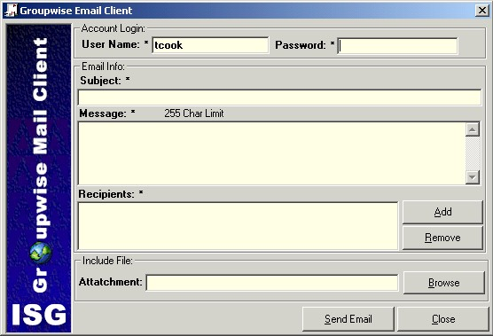



## Groupwise Mail Client

### Description

Quick and Clean sample to Email through Groupwise and send attatchments. Collection Based Recipients and Early bound. Code can work in Access also. Groupwise must be installed to work.

If you like please rate.
 
### More Info
 
When MAPI causes Attatchment problems with Groupwise installed. Use Groupwise Client instead of MAPI.

             |
---                |---
**Submitted On**   |2001-06-07 13:00:46
**By**             |[Tim Cook](https://github.com/Planet-Source-Code/PSCIndex/blob/master/ByAuthor/tim-cook.md)
**Level**          |Intermediate
**User Rating**    |3.0 (12 globes from 4 users)
**Compatibility**  |VB 6\.0, VBA MS Access
**Category**       |[Miscellaneous](https://github.com/Planet-Source-Code/PSCIndex/blob/master/ByCategory/miscellaneous__1-1.md)
**World**          |[Visual Basic](https://github.com/Planet-Source-Code/PSCIndex/blob/master/ByWorld/visual-basic.md)
**Archive File**   |[Groupwise 20762672001\.zip](https://github.com/Planet-Source-Code/tim-cook-groupwise-mail-client__1-23858/archive/master.zip)

